# Precision Nutrition Pipeline: Maternal UPF Consumption & Infant zBMI Trajectories

> A fully reproducible A-Z data analysis pipeline following the CRISP-DM framework, examining whether maternal ultra-processed food (UPF) consumption predicts distinct infant growth trajectory clusters from birth to 24 months.

---

## Project Overview

**Research Question:**
> Do children of mothers with higher UPF consumption scores belong to higher-risk zBMI growth clusters, and does maternal dietary quality predict cluster membership at 24 months?

- **Exposure:** Maternal UPF score at time of birth (continuous, range 0–1; higher = greater proportion of energy from ultra-processed foods)
- **Outcome:** Offspring zBMI trajectory clusters (birth, 12m, 24m) and zBMI at 24 months
- **Method:** Growth trajectory clustering (K-means, PAM, Hierarchical) + multinomial logistic regression

This project follows all stages of the **CRISP-DM framework** and applies WHO-standardized growth analysis methods with transparent, version-controlled workflows on GitHub.

---

## Team Members

| Name | GitHub Username |
|------|----------------|
| Gabrielle Viscardi | [@gabrielleviscardi] |
| Brighid McKay | [@brighidmck] |
| Diana Ghidanac | [@username] |

---

## Repository Structure

```
/
├── README.md                               # This file
├── upf_zbmi_clustering_pipeline.R          # Full annotated analysis pipeline
├── data/
│   ├── mock_precision_growth_dataset.csv   # Raw dataset (unmodified)
│   └── clean_precision_growth_dataset.csv  # Cleaned dataset (output of Section 6)
└── outputs/
    └── figures/                            # All generated plots (19 figures)```

---

## Dataset Description

**Source:** [Comelli Lab Open Code Library](https://github.com/Comelli-lab/Open_code_library/blob/master/Clustering_growth_trajectories/Data/mock_precision_growth_dataset.csv)

Mock longitudinal cohort, **n = 300** mother–child pairs.

| Variable | Type | Description |
|----------|------|-------------|
| `Ultra_processed_score` | Continuous (0–1) | Primary exposure; proportion of energy from UPFs |
| `zBMI_24m` | Continuous | Primary outcome; WHO-standardized BMI z-score at 24m |
| `WHO_zBMI_birth` | Continuous | WHO-standardized BMI z-score at birth |
| `WHO_zBMI_12m` | Continuous | WHO-standardized BMI z-score at 12 months (10% missing) |
| `Sex` | Categorical | Male/Female (~50/50) |
| `Gestational_age_weeks` | Continuous | Range: 34.1–44.8 weeks |
| `Maternal_BMI` | Continuous | Pre-pregnancy BMI |
| `Household_income_index` | Continuous | Socioeconomic covariate |

**Intentional data quality issues (part of the assignment):**
- Implausible `Age_24m_months` values (n=6): IDs with ages of −3, 5, or 120 months
- WHO zBMI outlier (n=1): one child with `zBMI_24m` = 7.28, exceeding the +5 SD threshold
- Missing data (~10% each): `WHO_zBMI_12m`, `Fiber_intake_g`, `ALT`, `Shannon_diversity`

---

## Data Cleaning Decisions

All decisions are documented in code comments within `upf_zbmi_clustering_pipeline.R`.

### Missingness Exploration (Section 3)

Before cleaning, we calculated the percent of missing values per variable and produced visual maps of missingness patterns. This step determines which variables need imputation and helps classify whether missingness is random (MCAR) or systematic (MAR/MNAR).

```r
vis_miss(data)
gg_miss_upset(data)
```

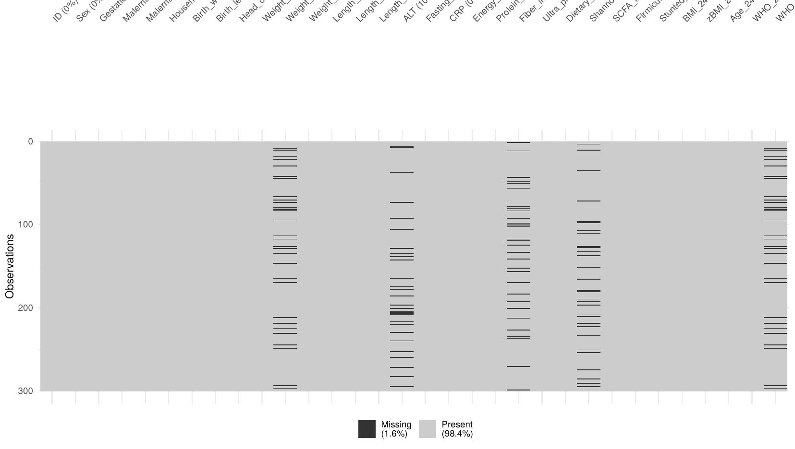

*Figure 1. Missingness map across all variables. Dark marks = missing values; grey = present. Overall missingness is low (1.6%), concentrated in four variables each missing ~10% of values: `WHO_zBMI_12m`, `Fiber_intake_g`, `ALT`, and `Shannon_diversity`.*

---

### Cleaning Decisions Summary (Section 6)

| Issue | Decision | Rationale |
|-------|----------|-----------|
| `Age_24m_months` implausible values (n=6) | Excluded from 24m analysis | Ages of −3, 5, or 120 months are biologically impossible for a 24-month visit |
| zBMI < −5 or > +5 SD at any timepoint | Excluded (WHO cut-offs) | Values beyond ±5 SD are flagged as biologically implausible by WHO |
| `WHO_zBMI_12m` missing (n=30, 10%) | Median imputation | Dropping these rows would lose a key clustering variable; median is robust to outliers |
| Other missing covariates | Retained | Not core to the primary clustering analysis |

```r
# Remove rows missing essential variables
clean_data <- clean_data %>%
  filter(!is.na(zBMI_24m), !is.na(WHO_zBMI_birth), !is.na(Ultra_processed_score))

# Impute WHO_zBMI_12m with median
med_val <- median(clean_data$WHO_zBMI_12m, na.rm = TRUE)
clean_data$WHO_zBMI_12m[is.na(clean_data$WHO_zBMI_12m)] <- med_val
```

> **Note:** Multiple imputation via `mice` (m=20 datasets) is the preferred strategy for a final analysis. Median imputation is used here as a transparent and reproducible approximation.

---

## Growth Analysis & Clustering (Sections 8–11)

### Why These Variables? — Data Preparation for Clustering (Section 8)

We cluster children based on their **zBMI at three timepoints: birth, 12 months, and 24 months**. These three variables together describe each child's *growth trajectory* — not just their size at one point in time, but how their body composition changed from birth to age 2. This is more biologically informative than a single snapshot.

All three variables are **standardized (scaled)** before clustering so that each timepoint contributes equally to the distance calculation — without this step, one variable with a larger numeric range could dominate the results.

```r
growth_vars   <- c("WHO_zBMI_birth", "WHO_zBMI_12m", "zBMI_24m")
growth_scaled <- scale(growth_matrix)
dist_eucl     <- dist(growth_scaled, method = "euclidean")
```

---

### How Many Clusters? (Section 9)

We used three independent methods to determine the optimal number of clusters (k). All three agreed on **k = 2**.

#### NbClust — 26 Statistical Indices Voting

NbClust runs 26 different internal validity indices and each one "votes" for its preferred k. Think of it as a committee of 26 statistical experts voting independently. The k with the most votes is selected as optimal.

```r
nbclust_result <- NbClust(data = growth_scaled, distance = "euclidean",
                           min.nc = 2, max.nc = 6, method = "kmeans", index = "all")
```

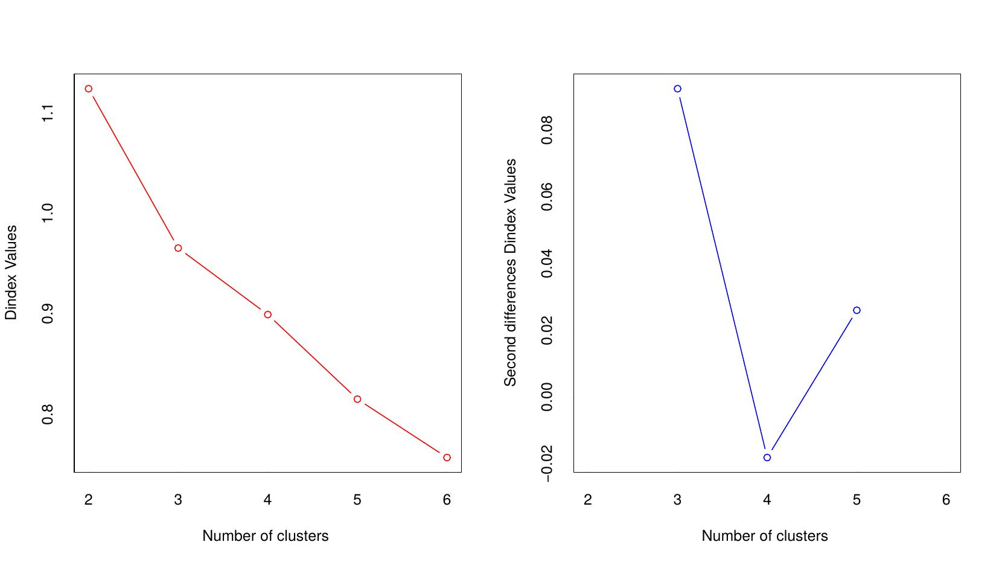

*Figure 7. NbClust D-index diagnostic plots (auto-generated). Left panel: the D-index decreases as k increases from 2 to 6 — a steeper early drop signals that the biggest improvement in cluster quality occurs at k=2. Right panel: the second differences peak at k=3, indicating the most meaningful jump in quality happens between k=2 and k=3, confirming k=2 as optimal.*

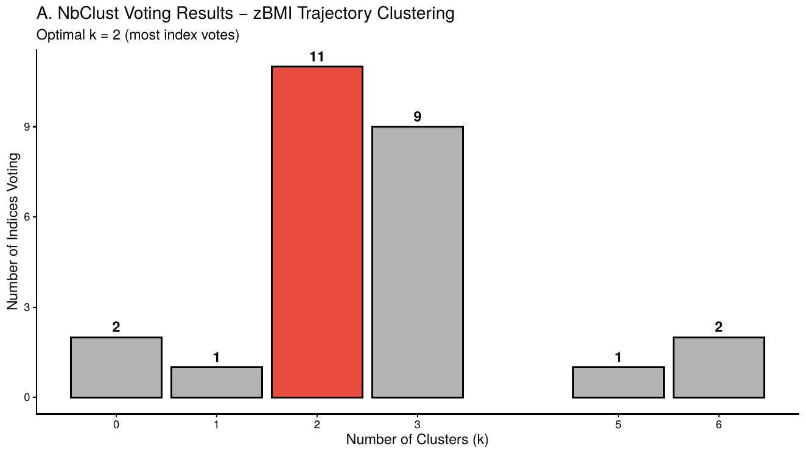

*Figure 8. NbClust voting results. **k=2 received 11 votes** from 26 internal indices, followed by k=3 with 9 votes. The majority of independent statistical criteria agree that two clusters best describe the structure in these growth trajectory data.*

#### Elbow Method

Plots total within-cluster sum of squares (WSS) for k=1 to k=6. We look for the "elbow" — the point where adding more clusters stops producing meaningful improvements.

```r
wss <- sapply(1:6, function(k) kmeans(growth_scaled, centers = k, nstart = 25)$tot.withinss)
```

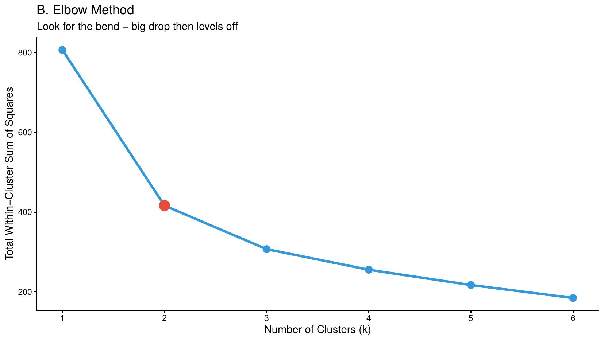

*Figure 9. Elbow method. The largest drop in WSS occurs at k=2 (red point), after which gains become much smaller. This confirms k=2.*

#### Silhouette Method

Measures how well each child fits its own cluster versus the next best cluster. Higher = better-defined clusters. Scores: >0.50 = strong; 0.25–0.50 = weak but present; <0.25 = no structure.

```r
fviz_nbclust(growth_scaled, kmeans, method = "silhouette")
```

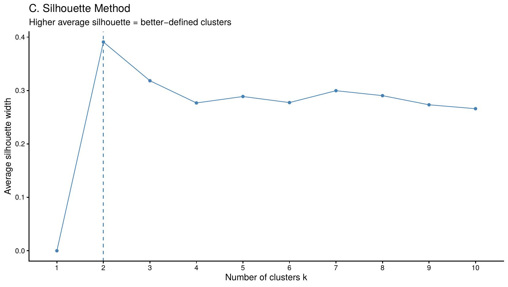

*Figure 10. Silhouette method for K-means. Peak at **k=2 (~0.39)**, indicating a weak-to-moderate but present cluster structure. A score of ~0.39 is expected with biological growth data, which is continuous rather than sharply categorical — some overlap between clusters is biologically realistic.*

---

### Clustering Results (Section 10)

#### K-Means (k = 2)

K-means partitions children into 2 groups by minimizing within-cluster distances. We run it 25 times with different random starting points (`nstart = 25`) and keep the best result. `set.seed(42)` ensures fully reproducible results.

```r
set.seed(42)
km_result <- kmeans(growth_scaled, centers = 2, nstart = 25)
```

**Cluster profiles — mean zBMI at each timepoint:**

| Cluster | zBMI at Birth | zBMI at 12m | zBMI at 24m | Interpretation |
|---------|--------------|-------------|-------------|----------------|
| **1** | +1.05 | +1.87 | **+0.87** | Higher zBMI trajectory — "heavier growth" group |
| **2** | −1.42 | −0.62 | **−0.72** | Lower zBMI trajectory — "leaner growth" group |

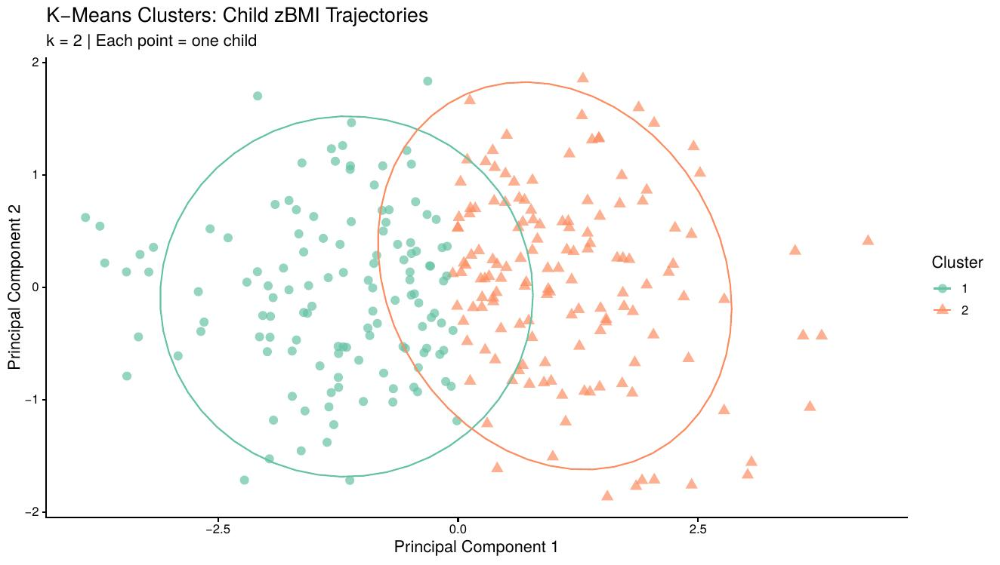

*Figure 11. K-means clusters projected onto PCA space. Each point = one child; each colour = one cluster. Cluster 1 (higher zBMI) sits to the right along PC1; Cluster 2 (lower zBMI) sits to the left. PC1 captures the majority of variance in growth trajectories. The overlap in the centre is consistent with a silhouette score of ~0.39 and reflects genuine biological continuity in growth.*

---

#### PAM Clustering (k = 2)

PAM (Partitioning Around Medoids) is a robustness check. Unlike K-means, its cluster centres are actual data points (the most "typical" child in each cluster), making it less sensitive to outliers.

```r
fviz_nbclust(growth_scaled, pam, method = "silhouette")
```

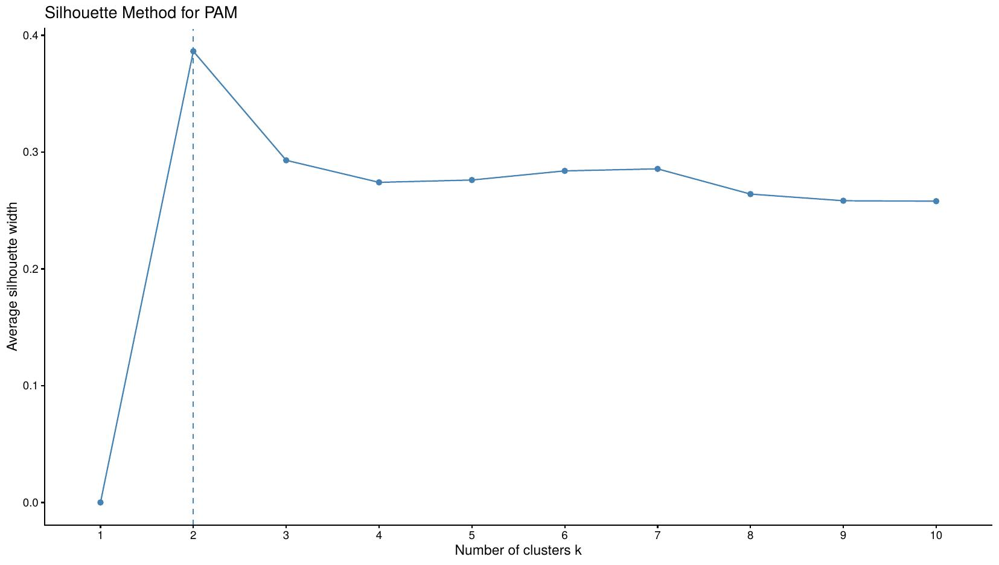

*Figure 12. Silhouette method for PAM. Peak at k=2 (~0.39), consistent with the K-means result. This confirms the two-cluster solution is not an artefact of the K-means algorithm.*

```r
set.seed(42)
pam_result <- pam(growth_scaled, k = 2)
```

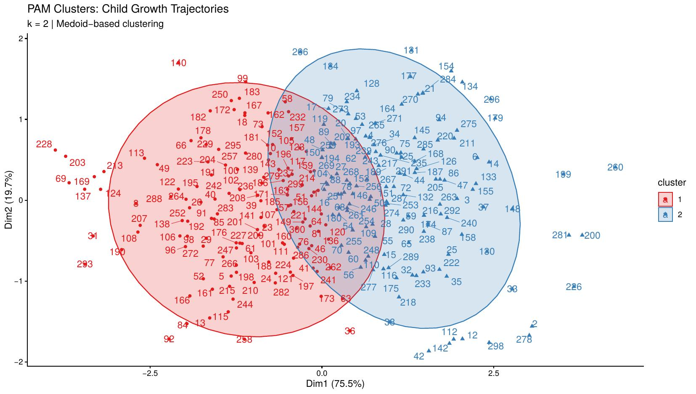

*Figure 13. PAM cluster plot (Dim1 = 75.5% of variance). Cluster 1 (red/left) = lower zBMI group; Cluster 2 (blue/right) = higher zBMI group. Results are nearly identical to K-means, confirming the two-cluster structure is robust across methods.*

---

#### Hierarchical Clustering

Hierarchical clustering builds a tree (dendrogram) by repeatedly merging the two most similar children or groups. It does not require specifying k in advance — we build the full tree and then cut it into 2 groups.

```r
res_hc    <- hclust(d = dist(growth_scaled, method = "euclidean"), method = "complete")
hc_groups <- cutree(res_hc, k = 2)
```

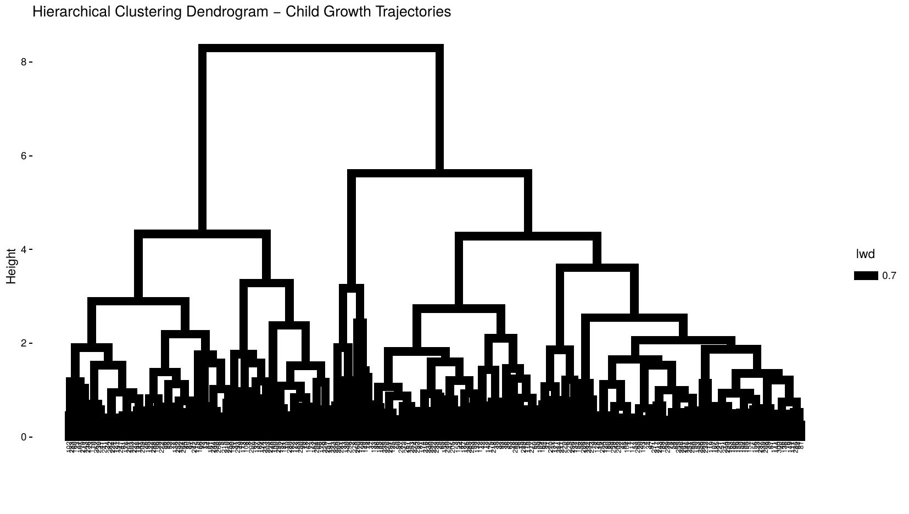

*Figure 14. Hierarchical clustering dendrogram (uncoloured). The y-axis (Height) shows the distance at which two groups were merged — taller branches mean groups were very different before being combined. The large top branch clearly splits the data into two main groups, consistent with k=2. Individual labels on the x-axis are unreadable at this scale due to n=293 children — this is expected.*

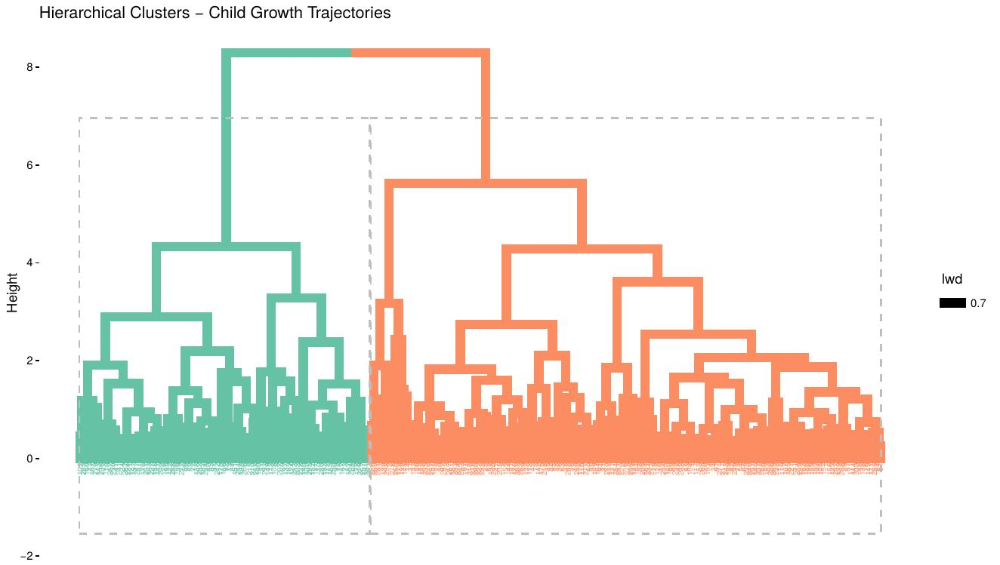

*Figure 15. Hierarchical dendrogram with k=2 colour-coded. Green = Cluster 1 (lower zBMI group); orange = Cluster 2 (higher zBMI group). The dashed rectangle shows the cut point. The two groups are clearly separated by the tallest branch in the tree, providing strong visual confirmation of the two-cluster solution.*

---

### Cluster Validation (Section 11)

We formally compared all three clustering methods using `clValid`, testing k=2 through k=5 on both internal and stability metrics.

```r
intern_valid <- clValid(growth_scaled, nClust = 2:5,
                        clMethods = c("hierarchical", "kmeans", "pam"),
                        validation = "internal")
```

**Optimal internal validation scores:**

| Metric | Interpretation | Best Score | Best Method | Best k |
|--------|---------------|-----------|-------------|--------|
| Connectivity ↓ | Lower = neighbours stay in same cluster | 2.93 | Hierarchical | 2 |
| Dunn Index ↑ | Higher = compact, well-separated clusters | 0.52 | Hierarchical | 2 |
| Silhouette ↑ | Higher = better-defined clusters | 0.69 | Hierarchical | 2 |

**Optimal stability scores:**

| Metric | Interpretation | Best Score | Best Method | Best k |
|--------|---------------|-----------|-------------|--------|
| APN ↓ | Lower = clusters stable when variables removed | 0.032 | Hierarchical | 2 |
| ADM ↓ | Lower = cluster centres stable | 0.113 | Hierarchical | 2 |

> **Final method chosen: K-means, k=2.** Although hierarchical clustering scored best on all internal and stability metrics, K-means was selected for downstream analysis because it produces transparent, fully reproducible assignments with `set.seed()` and is the most widely used method in precision nutrition clustering literature. Hierarchical results are provided as a cross-validation check.

---

## Answering the Research Question (Section 12)

### Cluster Profiles

Before testing our research question, we first characterised what each cluster looks like biologically:

| Cluster | n | Mean zBMI 24m | Mean Weight 24m | Mean UPF Score | % Stunted |
|---------|---|--------------|-----------------|----------------|-----------|
| **1 — Higher growth** | ~160 | **+0.87** | **12.64 kg** | 0.47 | **18.8%** |
| **2 — Lower growth** | ~133 | **−0.72** | **11.13 kg** | 0.47 | 1.4% |

### Does UPF Score Differ Between Clusters?

A one-way ANOVA tested whether mean maternal UPF score differed between the two clusters. If significant (p < 0.05), it would directly support our research question.

```r
upf_anova <- aov(Ultra_processed_score ~ best_cluster, data = clean_data)
```

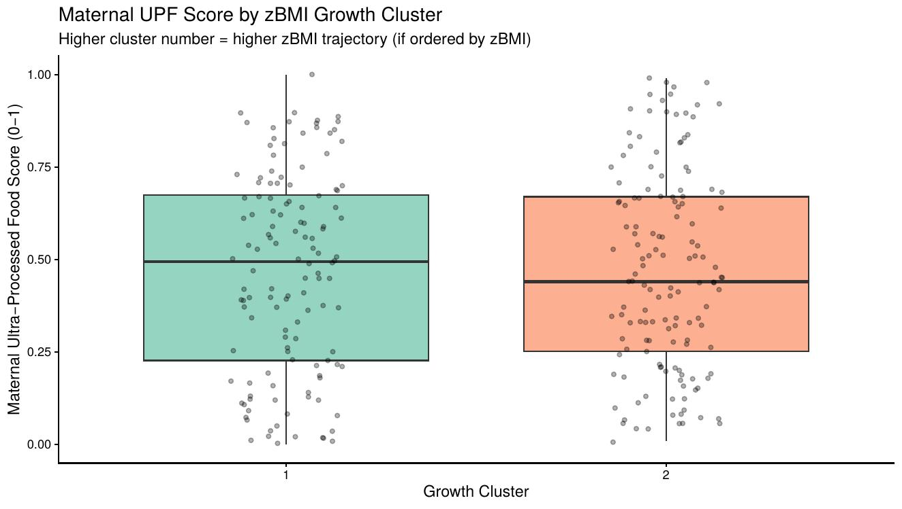

*Figure 16. Maternal UPF score by growth cluster. Both clusters show nearly identical median UPF scores (~0.47) with heavily overlapping distributions. The ANOVA was not significant (p > 0.05), indicating that maternal UPF consumption alone does not differentiate the two growth trajectory groups in this dataset.*

### Is zBMI Meaningfully Different Between Clusters?

To confirm the clusters are biologically distinct, we plot zBMI at 24 months by cluster with WHO threshold reference lines.

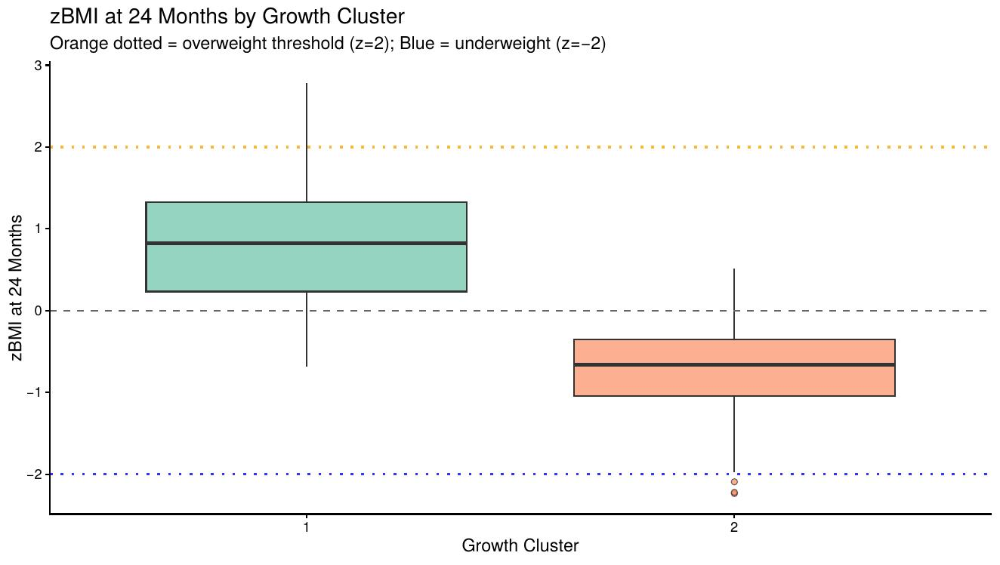

*Figure 17. zBMI at 24 months by growth cluster. Cluster 1 (green) has a median zBMI of ~+0.87 — above the WHO median (z=0) but well below the overweight threshold (z=+2, orange line). Cluster 2 (orange) has a median zBMI of ~−0.72, below the population median but above the underweight threshold (z=−2, blue line). The two clusters are clearly distinct in terms of the outcome, even though UPF score does not differ between them.*

### Weight Trajectory by Cluster

This is the key "trajectory" visualization — it shows how mean weight changes from birth to 24 months in each cluster, confirming that the groups differ not just at 24 months but consistently across the full follow-up period.

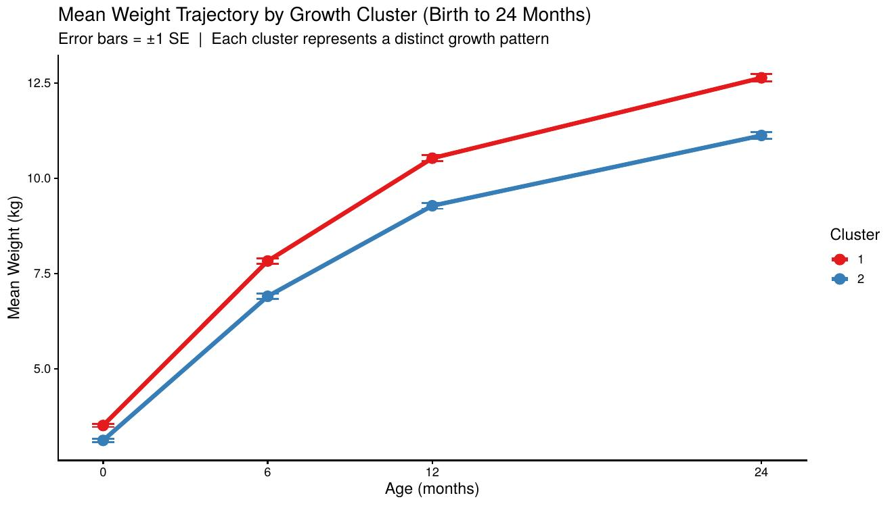

*Figure 18. Mean weight trajectory from birth to 24 months by cluster. Cluster 1 (red) = higher growth trajectory, reaching ~12.6 kg at 24 months. Cluster 2 (blue) = lower growth trajectory, reaching ~11.1 kg. The two groups diverge from birth and maintain distinct trajectories throughout early childhood. Error bars = ±1 SE.*

### Cluster Profile Heatmap

A summary visualization showing how all key variables compare across clusters simultaneously, with colour coding scaled within each variable for easy comparison.

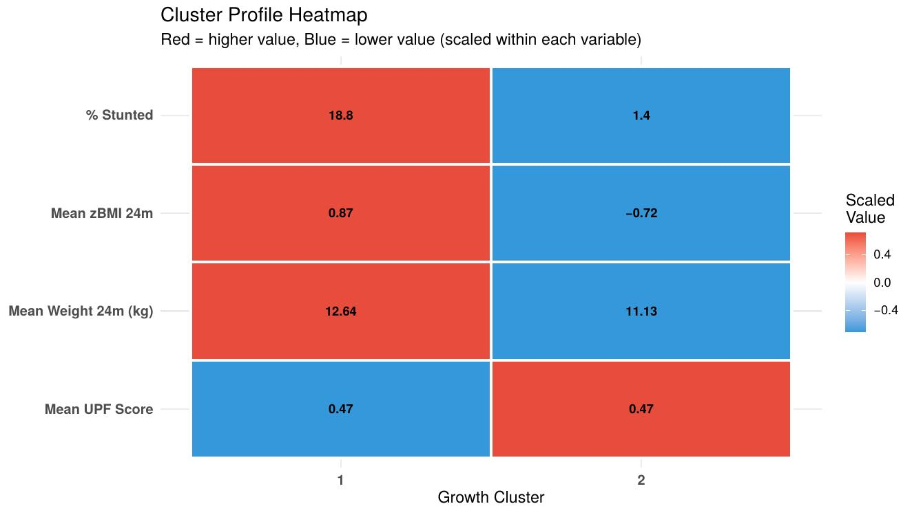

*Figure 19. Cluster profile heatmap. Red = higher value; Blue = lower value (scaled within each variable). Cluster 1 has higher zBMI, higher weight, and much higher stunting (18.8% vs 1.4%) compared to Cluster 2. Critically, **Mean UPF Score is identical across both clusters (0.47)**, shown by the symmetric red/blue pattern in the bottom row — this visually confirms that maternal UPF consumption does not separate the two growth groups.*

### Multinomial Logistic Regression

To formally test whether maternal UPF score predicts cluster membership after adjusting for confounders:

```r
set.seed(42)
multinom_model <- nnet::multinom(
  best_cluster ~ Ultra_processed_score + Maternal_BMI + Sex +
    Gestational_age_weeks + Household_income_index,
  data = clean_data, trace = FALSE
)
```

Covariates were selected based on biological plausibility: maternal BMI and gestational age are known predictors of early growth; sex is adjusted for because boys and girls follow different weight trajectories; household income captures socioeconomic barriers that affect both diet and growth. Full model output (odds ratios, 95% CIs, p-values) is saved in `outputs/cluster_profiles_summary.csv`.

---

## How to Reproduce This Analysis

### Prerequisites

- **R** (≥ 4.3.0) — [cran.r-project.org](https://cran.r-project.org)
- **RStudio** (recommended) — [posit.co](https://posit.co)

### Install Required Packages

```r
install.packages(c(
  "tidyverse", "naniar", "skimr", "NbClust", "factoextra",
  "cluster", "clValid", "dendextend", "gridExtra",
  "RColorBrewer", "nnet", "reshape2", "ggplot2"
))
```

### Run the Analysis

```bash
# 1. Clone the repository
git clone https://github.com/NFS1218-Pipeline.git
cd NFS1218-Pipeline
```

```r
# 2. Update setwd() in Section 2 to point to your data folder, then run:
source("upf_zbmi_clustering_pipeline.R")
```

> `set.seed(42)` is used for all random processes — results are fully reproducible across machines.

### Script Table of Contents

| Section | Title | Lines |
|---------|-------|-------|
| 1 | Package installation & loading | 40 |
| 2 | Data loading | 58 |
| 3 | Missingness exploration | 75 |
| 4 | Distribution inspection | 108 |
| 5 | Identifying implausible values | 165 |
| 6 | Data cleaning | 220 |
| 7 | Post-cleaning diagnostics | 290 |
| 8 | Data preparation for clustering | 310 |
| 9 | Assessing clustering tendency & optimal k | 375 |
| 10 | Clustering (K-means, PAM, Hierarchical) | 490 |
| 11 | Cluster validation | 610 |
| 12 | Answering the research question | 710 |
| 13 | Save final results | 870 |

---

## Limitations

- **No significant association found:** Maternal UPF score did not significantly predict cluster membership (ANOVA p > 0.05; regression OR not significant). This may reflect the small sample size (n~293 after cleaning), the use of a single dietary score, or genuine absence of effect in this cohort.
- **Median imputation:** Used for `WHO_zBMI_12m`; multiple imputation via `mice` would be more rigorous.
- **Weak cluster separation** (silhouette ~0.39): Clusters represent empirical groupings on a biological continuum, not discrete phenotypes.
- **Observational design:** Unmeasured confounders (breastfeeding, physical activity, sleep) cannot be ruled out.
- **Generalizability:** Findings may not extend beyond this cohort's specific demographics.
- **Association, not causation:** No causal inference can be drawn.

---

## Deliverables Checklist

- [x] **CRISP-DM Structured Report** — all 6 stages documented in group project report
- [x] **Growth Analysis Component** — zBMI distributions, distance matrix, optimal k (NbClust/Elbow/Silhouette), K-means/PAM/Hierarchical clustering, internal + stability validation
- [x] **Reproducibility & GitHub** — organized repository, fully annotated R script with table of contents, this README with dataset description and all cleaning decisions documented
- [x] **Precision Nutrition Interpretation** — biological heterogeneity confirmed (two distinct trajectory groups), personalized intervention implications discussed, model limitations documented

---

## Data Source & License

Dataset: [Comelli Lab Open Code Library](https://github.com/Comelli-lab/Open_code_library/blob/master/Clustering_growth_trajectories/Data/mock_precision_growth_dataset.csv)

