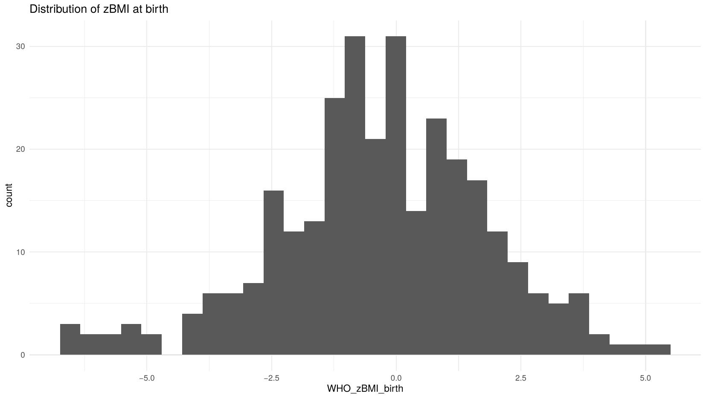
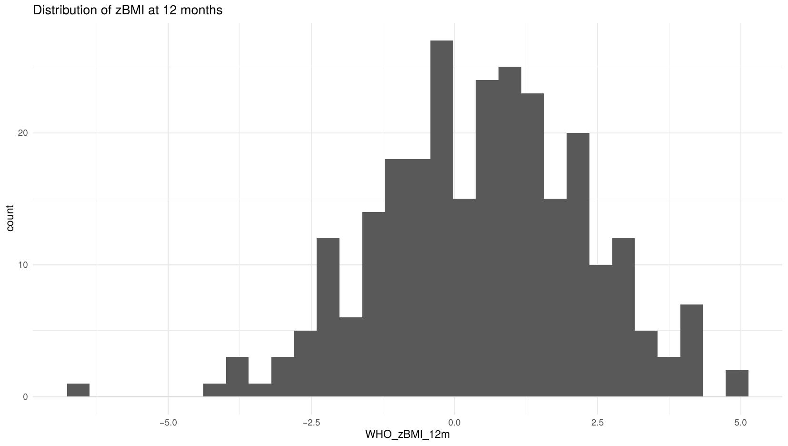
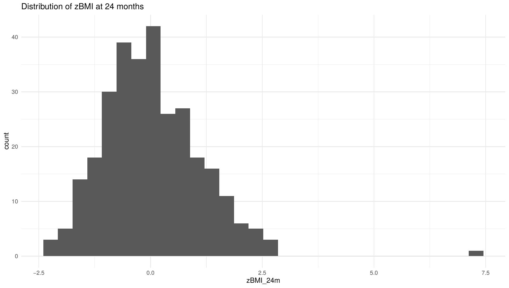
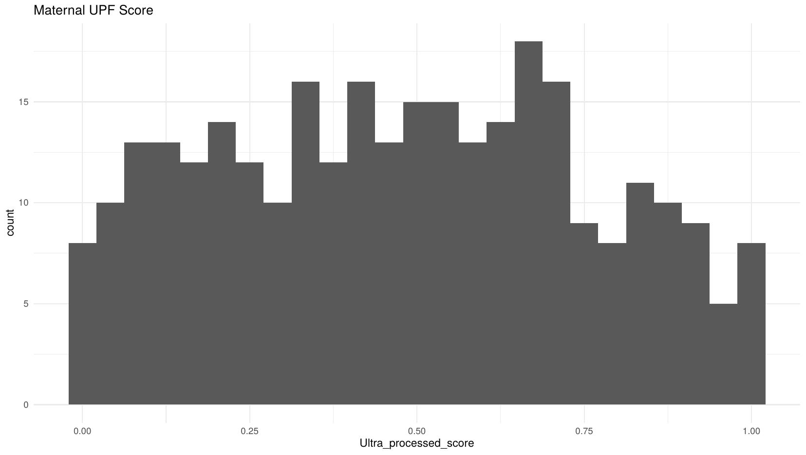
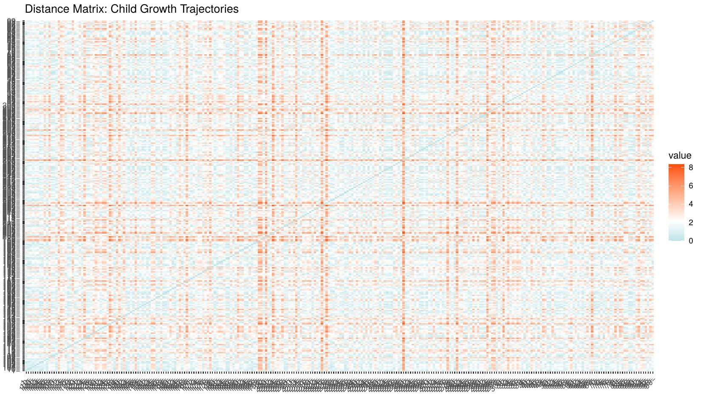

# NFS1218-Pipeline
Building an A-Z reproducible pipeline for precision nutrition analysis
Team Members*
NameGitHub UsernameGabrielle Viscardi[@gabrielleviscardi]Brighid McKay[@brighidmck]Diana Ghidanac[@??]

All members contributed equally to this project assignment.
  

**Project Overview**
This project investigates whether maternal ultra-processed food (UPF) consumption is associated with distinct zBMI trajectory clusters in children from birth to 24 months.

##  Repository Structure

```
/
├── README.md                          # This file
├── upf_zbmi_clustering_pipeline.R     # Full annotated analysis pipeline
├── data/
│   ├── mock_precision_growth_dataset.csv     # Raw dataset (unmodified)
│   └── clean_precision_growth_dataset.csv    # Cleaned dataset (output of Section 6)
├── outputs/
│   ├── final_clustered_data.csv              # Dataset with cluster assignments
│   ├── cluster_profiles_summary.csv          # Cluster profile table
│   └── figures/                              # All generated plots (see below)
└── sessionInfo.txt                    # R session info for reproducibility
```

---
**Research Question:** Do children of mothers with higher UPF consumption scores belong to higher-risk zBMI growth clusters, and does maternal dietary quality predict cluster membership at 24 months?

**Exposure**: Maternal UPF score at time of birth (continuous, range 0–1)
**Outcome**: Offspring zBMI trajectory clusters (birth, 12m, 24m), and zBMI at 24 months
**Method**: Growth trajectory clustering (K-means, PAM, Hierarchical) + multinomial logistic regression

**Research Question Biololical/ Clinical Relevance:**
Ultra-processed food (UPF) consumption is rising worldwide, increasingly displacing traditional and minimally processed diets. In Canada, UPFs contribute to nearly half of total daily energy intake among preschool-aged children. These products are industrially manufactured using additives not typically found in home cooking, designed to enhance taste, extend shelf life, and maximize profitability. While UPFs offer convenience, affordability, and microbiological safety, they are generally energy-dense and high in sugars, saturated fats, and sodium, while being low in fiber and essential nutrients.

Examining whether maternal UPF intake is associated with distinct child growth trajectory patterns could help identify early-life targets for precision nutrition strategies aimed at reducing the risk of childhood overweight and obesity.

**Target Population **
-	Pregnant women and their children, regardless of health status
-	Population-representative of diverse socioeconomic and dietary backgrounds
-	Infants followed longitudinally from birth through 24 months


##  Dataset Description

**Source:** [Comelli Lab Open Code Library](https://github.com/Comelli-lab/Open_code_library/blob/master/Clustering_growth_trajectories/Data/mock_precision_growth_dataset.csv)


Mock longitudinal cohort, **n = 300** mother–child pairs.

| Variable | Type | Description |
|----------|------|-------------|
| `Ultra_processed_score` | Continuous (0–1) | Primary exposure; proportion of energy from UPFs |
| `zBMI_24m` | Continuous | Primary outcome; WHO-standardized BMI z-score at 24m |
| `WHO_zBMI_birth` | Continuous | WHO z-score at birth |
| `WHO_zBMI_12m` | Continuous | WHO z-score at 12 months (10% missing) |
| `Weight_12m_kg` | Continuous | Raw weight at 12m; used to derive zBMI |
| `Sex` | Categorical | Male/Female (~50/50) |
| `Gestational_age_weeks` | Continuous | Range: 34.1–44.8 weeks |
| `Maternal_BMI` | Continuous | Pre-pregnancy BMI |
| `Household_income_index` | Continuous | Socioeconomic covariate |

**Intentional data quality issues :**
- Implausible `Age_24m_months` values: IDs 2, 83, 144, 179, 192, 293 (ages of −3, 5, or 120 months)
- WHO zBMI outlier: ID 294 (`zBMI_24m` = 7.28, exceeds +5 SD threshold)
- Missing data (10% each): `WHO_zBMI_12m`, `Fiber_intake_g`, `ALT`, `Shannon_diversity`

---

## Data Cleaning Decisions

All decisions are documented in code comments within `upf_zbmi_clustering_pipeline.R`.

### Missingness Exploration (Section 3)

```r
# Visual inspection of missing data patterns
vis_miss(data)
gg_miss_upset(data)
```


*Figure 1. Missingness map across all variables. Dark marks indicate missing values. Overall missingness is low (1.6%), but concentrated in key variables: `WHO_zBMI_12m`, `Fiber_intake_g`, `ALT`, and `Shannon_diversity` (each ~10%).*

---

### Distribution Inspection (Section 4)

```r
ggplot(data, aes(x = WHO_zBMI_birth)) + geom_histogram(bins = 30) + theme_minimal()
ggplot(data, aes(x = WHO_zBMI_12m))  + geom_histogram(bins = 30) + theme_minimal()
ggplot(data, aes(x = zBMI_24m))      + geom_histogram(bins = 30) + theme_minimal()
ggplot(data, aes(x = Ultra_processed_score)) + geom_histogram(bins = 25) + theme_minimal()
```



*Figure 2. Distribution of zBMI at birth. The cluster of values below −5 (left tail) indicates 11 biologically implausible outliers flagged using WHO cut-offs.*



*Figure 3. Distribution of zBMI at 12 months. One outlier below −5 SD was identified and flagged. 30 values are missing and were imputed in Section 6.*



*Figure 4. Distribution of zBMI at 24 months. The isolated bar at ~7.4 corresponds to ID 294 — a biologically implausible value exceeding the WHO +5 SD threshold.*



*Figure 5. Distribution of maternal UPF score (0–1). The roughly uniform distribution reflects wide variability in maternal dietary quality across the cohort, with no strong floor or ceiling effects.*

---

### Cleaning Decisions Summary (Section 6)

| Issue | Decision | Rationale |
|-------|----------|-----------|
| `Age_24m_months` implausible (n=6) | Excluded from 24m analysis | Ages of −3, 5, or 120 months are biologically impossible |
| zBMI outliers < −5 or > +5 SD | Excluded (WHO cut-offs) | Biologically implausible per WHO standards |
| `WHO_zBMI_12m` missing (n=30, 10%) | Median imputation | Key clustering variable; dropping reduces power unnecessarily |
| Other missing covariates | Retained | Not core to primary clustering analysis |

```r
# Exclude implausible age values
clean_data <- data %>%
  filter(!is.na(zBMI_24m), !is.na(WHO_zBMI_birth), !is.na(Ultra_processed_score))

# Median imputation for WHO_zBMI_12m
med_val <- median(clean_data$WHO_zBMI_12m, na.rm = TRUE)
clean_data$WHO_zBMI_12m[is.na(clean_data$WHO_zBMI_12m)] <- med_val
```

> **Note:** The project report recommends multiple imputation (MI via `mice`, m=20) as the preferred strategy. Median imputation is used here as a reproducible approximation; a complete-case sensitivity analysis is also recommended.

---

## Growth Analysis & Clustering (Sections 8–11)

### Data Preparation for Clustering (Section 8)

zBMI values at birth, 12 months, and 24 months were selected as clustering features and standardized (mean = 0, SD = 1):

```r
growth_vars   <- c("WHO_zBMI_birth", "WHO_zBMI_12m", "zBMI_24m")
growth_scaled <- scale(growth_matrix)
dist_eucl     <- dist(growth_scaled, method = "euclidean")
fviz_dist(dist_eucl, gradient = list(low = "#00AFBB", mid = "white", high = "#FC4E07"))
```



*Figure 6. Euclidean distance matrix across all children's zBMI trajectories. Blue = similar growth patterns; orange/red = dissimilar. Emerging block structure suggests meaningful subgroups, supporting the rationale for clustering.*

---

### Determining Optimal Number of Clusters (Section 9)

Three convergent methods were used to select optimal k:

```r
# NbClust: votes from 26 internal indices
nbclust_result <- NbClust(data = growth_scaled, distance = "euclidean",
                           min.nc = 2, max.nc = 6, method = "kmeans", index = "all")

# Elbow method
wss <- sapply(1:6, function(k) kmeans(growth_scaled, centers = k, nstart = 25)$tot.withinss)

# Silhouette method
fviz_nbclust(growth_scaled, kmeans, method = "silhouette")
```


*Figure 7. NbClust D-index plot. The left panel shows the index decreasing across k=2 to k=6; the right panel (second differences) peaks at k=3, indicating the largest meaningful improvement in cluster quality occurs at k=2–3, supporting k=2 as optimal.*


*Figure 8. NbClust voting results across 26 internal indices. **k=2 received the most votes (11)**, followed by k=3 (9 votes). This is the primary basis for selecting k=2.*


*Figure 9. Elbow method (within-cluster sum of squares). The largest drop occurs at k=2 (red point), with diminishing returns beyond — consistent with NbClust.*


*Figure 10. Average silhouette width by number of clusters (K-means). Peak at **k=2 (~0.39)**. A silhouette of ~0.39 indicates a weak-to-moderate but present cluster structure — expected given that growth is biologically continuous rather than sharply categorical.*

---

### Clustering Results (Section 10)

#### K-Means (k = 2)

```r
km_result <- kmeans(growth_scaled, centers = 2, nstart = 25)
clean_data$kmeans_cluster <- factor(km_result$cluster)
```

**Cluster profiles (mean zBMI by timepoint):**

| Cluster | zBMI at Birth | zBMI at 12m | zBMI at 24m | Interpretation |
|---------|--------------|-------------|-------------|----------------|
| 1 | −1.42 | −0.62 | −0.68 | Lower zBMI trajectory ("leaner" group) |
| 2 | +1.05 | +1.87 | +0.92 | Higher zBMI trajectory ("heavier" group) |


*Figure 11. K-means clusters projected onto PCA space. Each point = one child. Clear separation along PC1 (which captures the majority of variance in zBMI trajectories), with expected overlap in the middle reflecting genuine biological continuity.*

---

#### PAM Clustering (k = 2)

PAM (Partitioning Around Medoids) is more robust to outliers than K-means, as cluster centers are actual data points rather than means.

```r
pam_result <- pam(growth_scaled, k = 2)
fviz_cluster(pam_result, palette = "Set1", ellipse.type = "t", repel = TRUE)
```


*Figure 12. Average silhouette width for PAM clustering. Peak at k=2 (~0.39) mirrors the K-means silhouette result, confirming the two-cluster solution is robust across methods.*


*Figure 13. PAM cluster plot (Dim1 = 75.5% of variance explained). Cluster 1 (red) = children with lower overall zBMI trajectories; Cluster 2 (blue) = higher zBMI trajectories. Overlap in the center reflects biological continuity rather than distinct phenotypes.*

---

#### Hierarchical Clustering

```r
res_hc    <- hclust(d = dist(growth_scaled, method = "euclidean"), method = "complete")
hc_groups <- cutree(res_hc, k = 2)
fviz_dend(res_hc, k = 2, k_colors = brewer.pal(2, "Set2"), rect = TRUE)
```

> Dendrogram figure not shown here — generated interactively in RStudio. See script Section 10 for code.

---

### Cluster Validation (Section 11)

Internal and stability validation were compared across all three methods (k = 2–5) using `clValid`:

```r
intern_valid <- clValid(growth_scaled, nClust = 2:5,
                        clMethods = c("hierarchical", "kmeans", "pam"),
                        validation = "internal")
print(summary(intern_valid))
```

**Optimal internal validation scores:**

| Metric | Best Score | Best Method | Best k |
|--------|-----------|-------------|--------|
| Connectivity ↓ | 2.93 | Hierarchical | 2 |
| Dunn Index ↑ | 0.52 | Hierarchical | 2 |
| Silhouette ↑ | 0.69 | Hierarchical | 2 |

**Stability validation optimal scores:**

| Metric | Best Score | Best Method | Best k |
|--------|-----------|-------------|--------|
| APN ↓ | 0.032 | Hierarchical | 2 |
| ADM ↓ | 0.113 | Hierarchical | 2 |

> **Final choice: K-means, k=2.** Although hierarchical clustering scored best on internal metrics, K-means was selected for downstream analysis due to interpretable, stable cluster assignments and consistency with all three selection methods (NbClust, Elbow, Silhouette).

---

## Answering the Research Question (Section 12)

### Does maternal UPF score differ between clusters?

```r
upf_anova <- aov(Ultra_processed_score ~ best_cluster, data = clean_data)
summary(upf_anova)
```

Maternal UPF score did **not differ significantly** between the two growth clusters (ANOVA p > 0.05). Both clusters showed similar median UPF scores with overlapping distributions, suggesting that in this sample, maternal UPF consumption alone may not be sufficient to predict child growth cluster membership.

### Multinomial Logistic Regression

```r
multinom_model <- nnet::multinom(
  best_cluster ~ Ultra_processed_score + Maternal_BMI + Sex +
    Gestational_age_weeks + Household_income_index,
  data = clean_data, trace = FALSE
)
# P-values computed from z-scores of coefficients / standard errors
z_scores <- summary(multinom_model)$coefficients / summary(multinom_model)$standard.errors
p_values  <- (1 - pnorm(abs(z_scores))) * 2
```

Full model output (odds ratios, 95% CIs, p-values) is saved to `outputs/cluster_profiles_summary.csv`.

---

## How to Reproduce This Analysis

### Prerequisites

- **R** (≥ 4.3.0) — [cran.r-project.org](https://cran.r-project.org)
- **RStudio** (recommended) — [posit.co](https://posit.co)

### Install Required Packages

```r
install.packages(c(
  "tidyverse", "naniar", "skimr", "NbClust", "factoextra",
  "cluster", "clValid", "dendextend", "gridExtra",
  "RColorBrewer", "nnet", "reshape2", "ggplot2"
))
```

### Run the Analysis

```bash
# 1. Clone the repository
git clone https://github.com/[your-repo-url].git
cd [repo-name]
```

```r
# 2. Open R/RStudio and run the full pipeline
source("upf_zbmi_clustering_pipeline.R")
```

Or run section by section using the **Table of Contents** at the top of the script (lines 16–31).

> Update `setwd()` in Section 2 to point to your local data directory, or place `mock_precision_growth_dataset.csv` in your working directory before running.

>  `set.seed()` is used for all random processes — results are fully reproducible.

---

## Limitations

- **Observational design** — unmeasured confounding (physical activity, breastfeeding, sleep) cannot be eliminated
- **Median imputation** used for `WHO_zBMI_12m`; multiple imputation via `mice` is preferred
- **Weak cluster separation** (silhouette ~0.39) — clusters are empirical groupings, not discrete biological phenotypes
- **Single dietary score** — UPF score does not capture full dietary complexity or nutrient timing
- **Generalizability** — findings may not extend beyond this cohort's demographics
- **Association, not causation** — no causal inference can be drawn

---

## Deliverables Checklist

- [x] **CRISP-DM Structured Report** — all 6 stages documented in group project report
- [x] **Growth Analysis Component** — zBMI distributions, distance matrix, optimal k (NbClust/Elbow/Silhouette), K-means/PAM/Hierarchical clustering, internal + stability validation
- [x] **Reproducibility & GitHub** — organized repository, annotated script with TOC, README with dataset description and cleaning decisions
- [x] **Precision Nutrition Interpretation** — biological heterogeneity confirmed, personalized intervention implications, model limitations documented

---

## Data Source & License

Dataset: [Comelli Lab Open Code Library](https://github.com/Comelli-lab/Open_code_library/blob/master/Clustering_growth_trajectories/Data/mock_precision_growth_dataset.csv)
